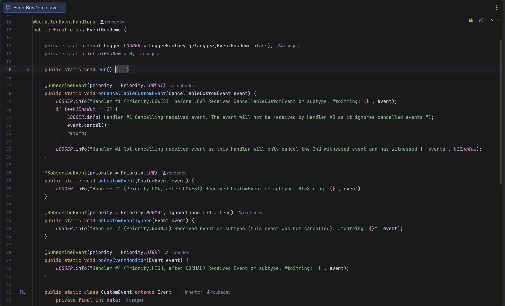

# java-utils

A collection of Java utilities, high performance event dispatching systems and experimental APIs for Java 21+.

> [!WARNING]
> Most components in this repository are under active development, highly experimental and subject to breaking changes.


_An example from `EventBusDemo.java` showing compile time `@SubscribeEvent` handler priority ordering and cancellation logic_

## Components

### EventBus
Status: Experimental (Usable)

A polymorphic event dispatching system supporting priority based routing utilising SPI loaded compile time generated
invoker factories for reflectionless dispatch when compiled with the annotation processor alongside high performance
reflective fallbacks via `LambdaMetafactory` and further `MethodHandle` fallbacks when generated invokers are absent.

Example: [EventBusDemo](./demo/src/main/java/com/github/rcubedev/demo/EventBusDemo.java)

#### Resolution path
* Event target (class with static handlers, instance with non-static handlers or a static `Method` handler) -> internal cache
  * **Cache hit:** Utilises precompiled invoker
  * **Cache miss:** Queries internal registry for compile time generated invokers, else falling back to `LambdaMetafactory` or `MethodHandle`. 

#### Benchmarks
Measured via JMH.

#### Event Dispatch
Lower is better (ns/op) [Mode=`avgt`, Cnt=`15`]

| Benchmark                                  | Score | Error  |
|--------------------------------------------|-------|--------|
| **Guarded Recursion**                      |
| Callback Dispatch                          | 3.607 | ±0.056 |
| Callback Dispatch (Cancellable)            | 3.627 | ±0.054 |
| Compiled Dispatch                          | 4.899 | ±0.051 |
| Compiled Dispatch (Cancellable)            | 5.187 | ±0.024 |
| `LambdaMetaFactory` Dispatch               | 3.608 | ±0.013 |
| `LambdaMetaFactory` Dispatch (Cancellable) | 4.973 | ±0.033 |
| `MethodHandle` Dispatch                    | 5.591 | ±0.040 |
| `MethodHandle` Dispatch (Cancellable)      | 6.255 | ±0.048 |
| **Unguarded Recursion**                    |
| Callback Dispatch                          | 2.671 | ±0.012 |
| Callback Dispatch (Cancellable)            | 2.679 | ±0.028 |
| Compiled Dispatch                          | 3.231 | ±0.026 |
| Compiled Dispatch (Cancellable)            | 3.530 | ±0.011 |
| `LambdaMetaFactory` Dispatch               | 2.762 | ±0.019 |
| `LambdaMetaFactory` Dispatch (Cancellable) | 3.294 | ±0.002 |
| `MethodHandle` Dispatch                    | 4.645 | ±0.046 |
| `MethodHandle` Dispatch (Cancellable)      | 4.990 | ±0.117 |

> [!NOTE]
> Currently usable but the public API is experimental and subject to change.

### Reflection API
Status: Experimental (Partially usable)

An experimental reflection wrapper to align with the Java Language Specification (JLS).

> [!WARNING]
> Currently rough around the edges and heavily subject to breaking changes and not recommended for production use in its current state.

### Services
Status: Experimental (Usable)

A multi layered and priority service loading framework.

Example: [ServiceDemo](./demo/src/main/java/com/github/rcubedev/demo/ServiceDemo.java)

### Registry
Status: Experimental (Usable)

A thread safe, freezable object registry model (`Registry<T>`).<br>
Has a mutate and freeze lifecycle. Allows registration during bootstrap then turns read only on freeze.

Example: [RegistryDemo](./demo/src/main/java/com/github/rcubedev/demo/RegistryDemo.java)

### Kaleido Config Helpers
Status: Experimental (Usable)

Helper utilities for simplifying configuration serialization

Example (serializable enum):
```java
public enum MyOption implements ISerializableEnum<MyOption> {
    FIRST,
    SECOND,
    THIRD
}
```

## Requirements
Java 21+

## Running the Demo
Download and run the latest `java_utils_demo-VERSION-all.jar` file from the [Releases](https://github.com/rcubedev/java-utils/releases/latest) page

```bash
java -jar java_utils_demo-VERSION-all.jar
```

## Usage
See the [demo](./demo) for runnable examples and the Javadocs for detailed API documentation.

Add the project as a dependency using [JitPack](https://jitpack.io/):

### Groovy DSL
```groovy
repositories {
    maven { url 'https://jitpack.io' }
}

dependencies {
    api 'com.github.rcubedev:java-utils:VERSION'
}
```

### Kotlin DSL
```kotlin
repositories {
    maven("https://jitpack.io")
}

dependencies {
    api("com.github.rcubedev:java-utils:VERSION")
}
```


## License
This project is licensed under the [Apache License 2.0](LICENSE).
